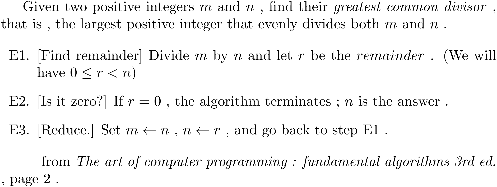

# euclids_algorithm
:toc:
:toclevels: 6

## euclids_algorithm

### question



### answer

### javascript implementation

###### ./src/parts/gcd.js
```

function gcd(m,n)
{
	r = m % n ;

	if (r == 0)
		return n ;

	m = n ;

	n = r ;
	
	return gcd(m,n) ;
}
```

### prolog implementation part 1

###### ./src/parts/gcd__a.prolog
```

gcd__a(M0,N0,Q)
:-
R is mod(M0,N0) ,
(
	R = 0 ->
	Q = N0 ;
	M = N0 ,
	N = R ,
	gcd__a(M,N,Q)
)
.

```

### prolog implementation part 2

The `_IF_ -> _THEN_ ; _ELSE_` construct
is undesirable because it
depends upon an side-effect .


###### ./src/parts/gcd__b.prolog
```

:- [library(clpfd)] .

:- op(1,'xfy','gcd__b_') .

gcd__b(M0,N0,Q)
:-
[loop] gcd__b_ (M0,N0,Q)
.

[loop] gcd__b_ (M0,N0,Q)
:-
R #= mod(M0,N0) ,
[remainder] gcd__b_ (M0,N0,Q,R)
.

[remainder] gcd__b_ (_M0,N0,Q,R0)
:-
R0 =:= 0 ,
Q is N0
.

[remainder] gcd__b_ (_M0,N0,Q,R0)
:-
R0 == 0 ,
M is N0 ,
N is R0 ,
[loop] gcd__b_ (M,N,Q)
.

```

#### tests

###### ./tests/parts/gcd__a.prolog
```
 include ./tests/parts/gcd__a.prolog
```

###### ./tests/parts/gcd__b.prolog
```
 include ./tests/parts/gcd__b.prolog
```

## appendix

### authorship

* (c) kintalken@gmail.com 2020-10-29 .
